# Customer-Sales-Analysis  

**Overview of Problem Statement**

*Problem Statement*

In the pursuit of enhancing sales strategies, Staples faces a critical challenge centered on analyzing consumer behavior. Understanding and optimizing these behavioral patterns is paramount for maximizing profitability and maintaining a competitive edge in the market. By delving deep into consumer actions, preferences, and purchasing habits, Staples aims to develop targeted approaches that resonate with its customer base, ultimately driving increased sales and sustained business growth.

*Justification for Choosing the Problem*

This problem was chosen due to its direct impact on Staples' strategic goals of increasing sales and market share. By leveraging detailed data analysis, we can provide actionable insights into how different factors affect sales outcomes. These insights will allow Staples to tailor their marketing and operational strategies to better meet consumer demands and improve financial performance. The analysis will focus on sales across different months and states, deviations from sales targets, and the effects of shipping options on delivery efficiency.

**Dataset Description**

The Analysis leverages multiple datasets from Staples to understand consumer behavior, sales distribution, and the effectiveness of promotions. Below is the data dictionary for each dataset utilized in our study.

|       Attribute       |     Type      |                                 Description                                  |
|:--------------:|:-----------------------:|:-----------------------------:|
|       Category        |  VARCHAR(50)  |            Represents the classification of products or services             |
|         City          |  VARCHAR(50)  |           The city in which the customer or transaction is located           |
|         Color         |  VARCHAR(50)  |                    The color specification of the product                    |
|         Cost          |  VARCHAR(50)  |                     Cost price of the product or service                     |
|        Country        |  VARCHAR(50)  | The country where the transaction takes place or where the customer resides. |
|      Customer ID      |  VARCHAR(50)  |                     Unique identifier for each customer                      |
|     Customer Name     |  VARCHAR(50)  |                             Name of the customer                             |
|      CustomerSK       |  VARCHAR(50)  |         Surrogate key for the customer dimension in a data warehouse         |
|         Date          |     DATE      |                      Specific date when an event occurs                      |
|        DateSK         |      INT      |           Surrogate key for the date dimension in a data warehouse           |
|      DateString       |  VARCHAR(50)  |                            Date in string format                             |
|          Day          |      INT      |                           Day of the month (1-31)                            |
|       DayofWeek       |      INT      |             Numeric representation of the day of the week (1-7)              |
|     DayofWeekName     |  VARCHAR(10)  |                       The name of the day of the week                        |
|       DayofYear       |      INT      |                          The day number of the year                          |
|       Discount        | NUMERIC(18,3) |                    The discount amount applied to a sale                     |
|      IsLeapYear       |      BIT      |             A Boolean indicating whether the year is a leap year             |
|       IsWeekend       |      BIT      |         A Boolean indicating whether the day is part of the weekend          |
|         Month         |      INT      |                     Numeric representation of the month                      |
|       MonthName       |  VARCHAR(10)  |                            The name of the month                             |
|        On Time        |      INT      |            Indicates whether the delivery or shipment was on time            |
|      Order Date       |   DATETIME    |                    The date on which the order was placed                    |
|       Order ID        |  VARCHAR(50)  |                      A unique identifier for each order                      |
|        OrderSK        |  VARCHAR(50)  |                        A surrogate key for the order                         |
|     Payment Type      |  VARCHAR(50)  |                          The method of payment used                          |
|    Payment_modeSK     |  VARCHAR(50)  |                     A surrogate key for the payment mode                     |
|      Postal Code      |  VARCHAR(50)  |                 The postal code where the order is delivered                 |
|      Product ID       |  VARCHAR(50)  |                     A unique identifier for each product                     |
|       ProductSK       |  VARCHAR(50)  |                       A surrogate key for the product                        |
|        Profit         | NUMERIC(18,3) |                  The profit made from the sale of a product                  |
| Promotion Description |  VARCHAR(50)  |              Description of any promotions applied to the order              |
|     Promotion ID      |  VARCHAR(50)  |                    A unique identifier for each promotion                    |
|      PromotionSK      |  VARCHAR(50)  |                      A surrogate key for the promotion                       |
|       Quantity        | NUMERIC(18,3) |                   The number of units of the product sold                    |
|        Quarter        |      INT      |          The quarter of the year in which the transaction occurred           |
|        Region         |  VARCHAR(50)  |            The region in which the order was placed or delivered             |
|      Retail Cost      | NUMERIC(18,3) |                        The cost price of the product                         |
|         Sales         | NUMERIC(18,3) |                     The total sales amount for the order                     |
|        Segment        |  VARCHAR(50)  |               The market segment to which the customer belongs               |
|       Ship Date       |   DATETIMED   |                   The date on which the order was shipped                    |
|       Ship Mode       |  VARCHAR(50)  |                          The mode of shipment used                           |
|         State         |  VARCHAR(50)  |                    The state where the order is delivered                    |
|     Sub-Category      |  VARCHAR(50)  |               A further classification of the product category               |
|    Turnaround Time    |      INT      |               The time taken from order placement to shipment                |
|      Unit Price       | NUMERIC(18,3) |                      The price per unit of the product                       |
|         Week          |      INT      |                         The week number of the year                          |
|         Year          |      INT      |                  The year in which the transaction occurred                  |

**Data Warehouse Design and Implementation**

*Dimension modeling process\
*\
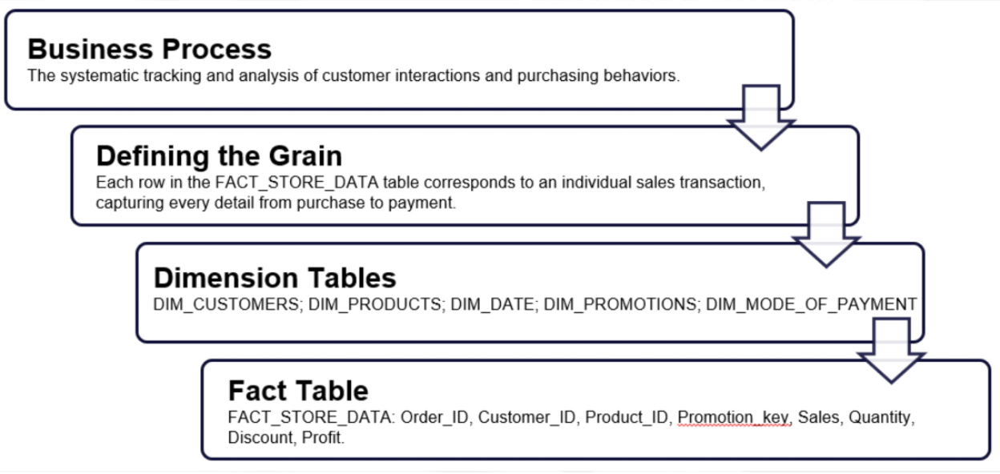

*Star Schema\
*\
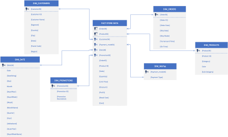{width="448"}

\
*Snapshot of Our Dataset\
*\
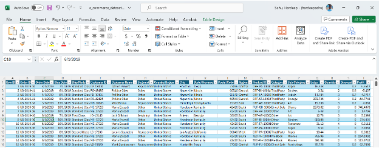

*Snapshot of Python code to connect and data import*

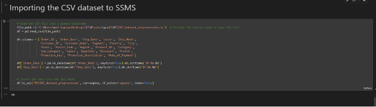{width="622"}\

*Control Flow Diagram\
\
*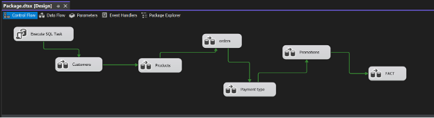

SSIS is used to generate a star schema.

**Data Flow Diagram (DFD)\
**\
*Customer DFD*

*Order DFD*

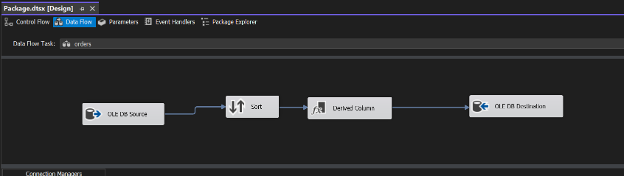

*Derived Column On Time*\
(Ship_Mode== "First Class" && (DATEDIFF("day",(DT_DBTIMESTAMP)Order_Date,(DT_DBTIMESTAMP)Ship_Date) \<= 2)) ? 1 : (Ship_Mode == "Second Class" && (DATEDIFF("day",(DT_DBTIMESTAMP)Order_Date,(DT_DBTIMESTAMP)Ship_Date) \<= 3)) ? 1 : (Ship_Mode == "Standard Class" && (DATEDIFF("day",(DT_DBTIMESTAMP)Order_Date,(DT_DBTIMESTAMP)Ship_Date) \<= 5)) ? 1 : (Ship_Mode == "Same Day" && DATEDIFF("day",(DT_DBTIMESTAMP)Order_Date,(DT_DBTIMESTAMP)Ship_Date) \<= 1) ? 1 : 0

*Turnaround Time*\
DATEDIFF("DAY",(DT_DBTIMESTAMP)Order_Date,(DT_DBTIMESTAMP)Ship_Date)

*FACT DFD*\
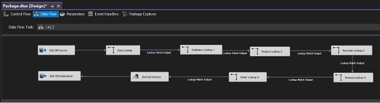

**Data Preparation**

The dataset was successfully loaded into a panda DataFrame, which contains 10,194 entries and 20 columns, detailing order information, customer data, product categories, sales, quantities, discounts, and profits.

Few uncertainties in the data were removed for clarity and uniformity.\
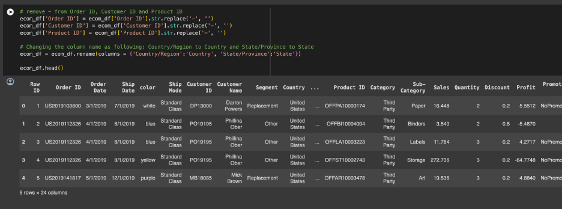

*Duplicate Removal*\
Checked for duplicate rows in the data, identifying and removing a total of 5 duplicate entries.\
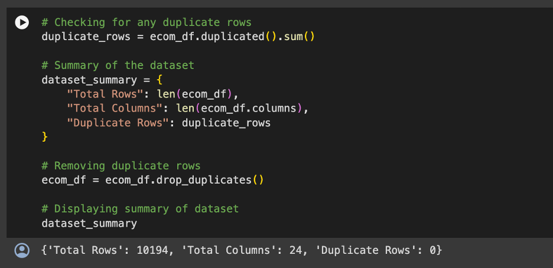

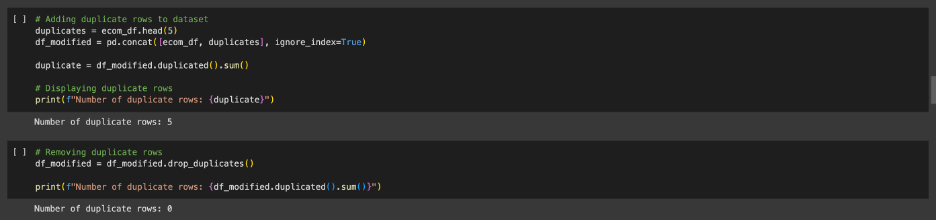\
\
*Missing Values*\
Identified missing values in columns 'Segment', 'Sales', and 'Quantity', with 50 missing entries each.

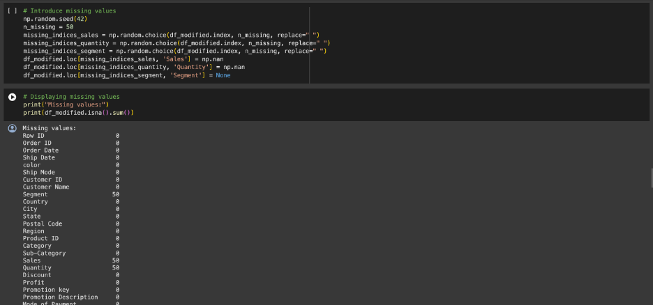

**Data Visualization**

Several visualizations were created, including histogram for Quantity sold based on Sub-Category, and a scatter plot comparing sales and profit, providing visual insights into the data distributions and relationships between key variables. The visualizations which are generated for the Data preprocessing can be seen below.

A histogram for 'Quantity' sold based on 'Sub-Category' distribution showed that the Sub-Category 'Binders' sold the most quantity among other categories.\
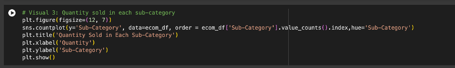

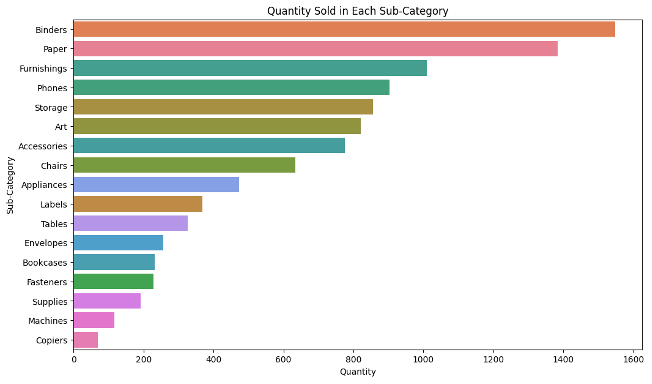\
\
A scatter plot between 'Sales' and 'Profit' revealed the relationship between these two variables, highlighting the variance in profit for given sales figures and potential outliers or high-leverage points that could influence further analysis.\
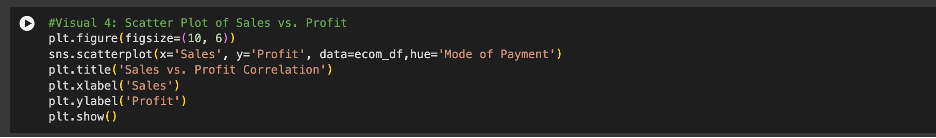

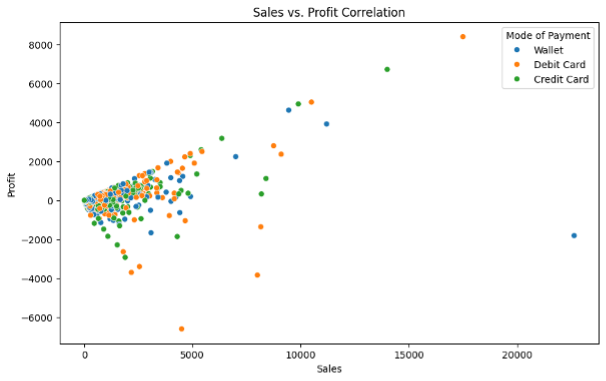

**Data Exploration**

Exploratory Data Analysis (EDA) Descriptive Statistics: Calculated descriptive statistics, providing a summary of the central tendency, dispersion, and shape of the dataset's distribution. Descriptive statistics for 'Sales' and 'Profit' were included, offering insights into average sales and profit margins, as well as understanding the variability and distribution of these key metrics.

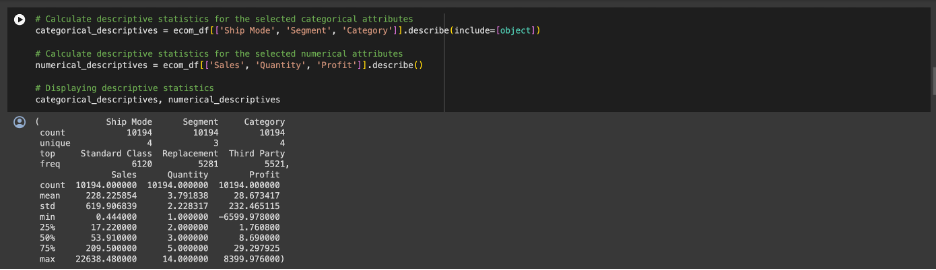

*Descriptive Statistics Results*\
The average (mean) 'Sales' were approximately \$228, but the median (50th percentile) was much lower at \$53.91, indicating the presence of high-value sales transactions that skew the average.

The 'Profit' had a mean of approximately \$28.67 and a median of \$8.69, suggesting that most transactions yielded a modest profit, with a few transactions resulting in significantly higher profits.

The standard deviation for 'Profit' was relatively high, pointing to large variations in profitability across transactions.

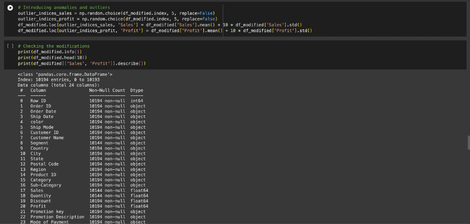

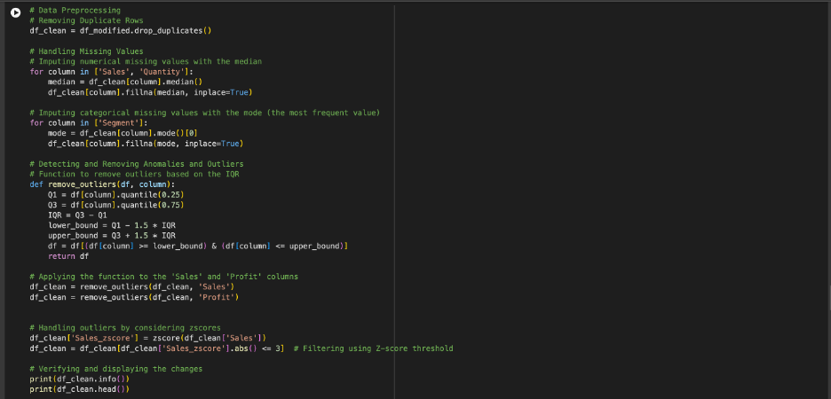

**Data Transformation**

\
*One Hot Encoding\
*\
This technique converts categorical variables into a form that could be provided to machine learning algorithms to better predict the outcome. However, an error with the OneHotEncoder suggests there might have been a problem with this step.

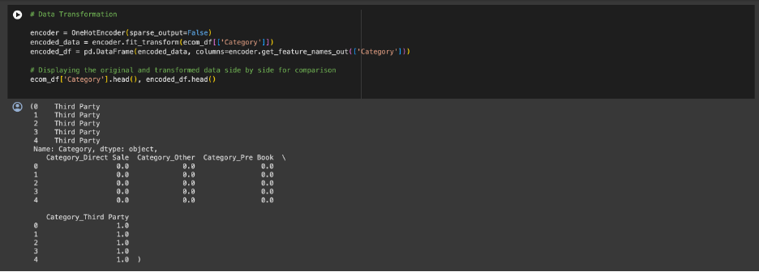

*Standardization*\
\
We included a computation of z-scores for the 'Sales' column, which is a form of standardization. This process adjusts the data to have a mean of 0 and a standard deviation of 1, which is particularly useful for comparison between different datasets and for models that assume normally distributed data.

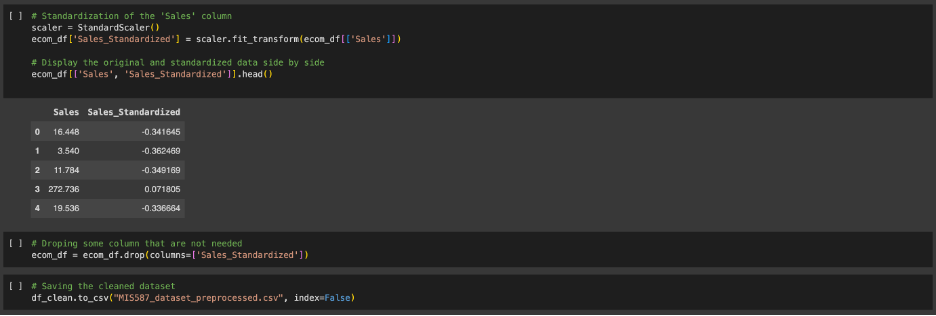

**Data Analysis and Results**

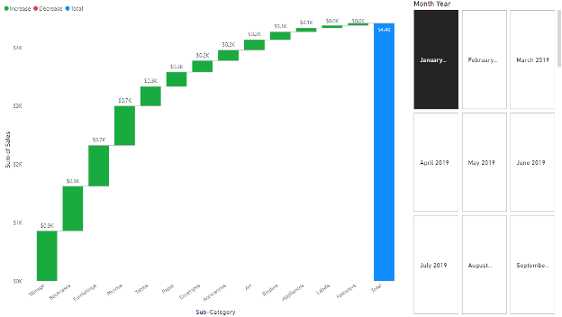

The visualization is a waterfall chart that displays the sales contributions of various sub-categories within a company. It aims to show how each sub-category contributes to the total sales, highlighting both positive and negative impacts on the overall financial performance.

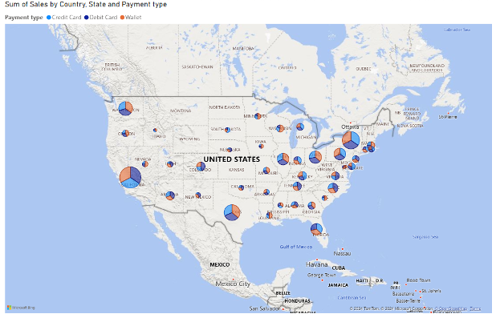

The visualization is a geographical map of the United States displaying the sum of sales by state, differentiated by payment type---credit card, debit card, and digital wallet. Each state has pie charts overlaid on the map, where the size of each pie segment represents the proportion of sales from each payment method in that state. This map helps in identifying payment preferences across different regions and can be used to tailor marketing strategies, like targeted promotions and discounts, based on the preferred payment methods in each area.

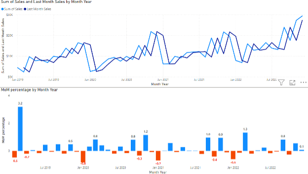

The visualization consists of two parts:

Top Chart (Line Graph): Shows the sum of sales and last month's sales by month over a period from January 2019 to around mid-2023. This graph is useful for observing the trends in sales over time, identifying any seasonal patterns, and noting any significant peaks or drops in sales.

Bottom Chart (Bar Graph): Displays the month-over-month (MoM) percentage change in sales during the same period. Positive values (shown in blue) indicate months where sales increased compared to the previous month, while negative values (shown in red) indicates a decrease. Overall, this visualization helps in understanding how sales fluctuated month to month over several years, providing insights that could be used to make strategic business decisions, optimize sales efforts, and forecast future trends.

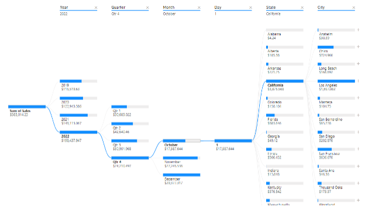

The visualization is an interactive hierarchy chart, also known as a drill-down chart, used to display sales data over multiple years, broken down further into quarters and months for detailed analysis. The left side of the chart shows a timeline of annual sales totals, which can be expanded to reveal sales figures for each quarter within a year, and further into each month.

On the right side, the chart offers a geographical breakdown of sales by state and even more detailed data by city within each state. This allows users to click through and see precisely how much was sold each year, quarter, and month, and understand the distribution of sales geographically.

The purpose of this visualization is to provide a comprehensive view of sales trends over time and across different regions. This insight is crucial for identifying patterns, planning marketing strategies, and allocating resources efficiently based on where and when products are selling best.

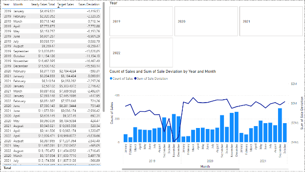

The visualization displays a comprehensive analysis of sales data over several years. It consists of three parts:

Data Table: This table shows monthly sales data for each year, including actual sales, target sales, and the deviation between the two. This allows for a detailed month-by-month comparison of expected versus actual financial performance. Bar Chart: Represents the count of sales transactions each month. Line Chart: Plots the sum of sale deviations (difference between actual and target sales) over the same period.

The combination of these elements in the visualization provides a clear overview of sales performance, highlighting where and when sales fell short of or exceeded targets. This kind of analysis is critical for businesses to understand sales trends, identify potential issues, and make informed decisions to improve future performance.

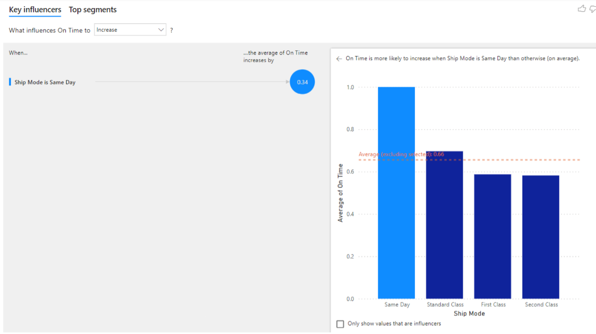

The visualization is focused on analyzing the impact of different shipping modes on the on-time delivery rate of orders. It clearly shows that 'Same Day' shipping significantly increases the likelihood of on-time delivery compared to other shipping options like 'Standard Class,' 'First Class,' and 'Second Class.'

The bar chart illustrates this by displaying a much higher average on-time delivery rate for 'Same Day' shipments. This suggests that if timeliness is critical, 'Same Day' shipping is the most effective mode. This insight can help businesses prioritize shipping options and improve customer satisfaction by ensuring timely deliveries.

**Business Implications**

Linking back to the initial problem statement of increasing competition, customer retention, and cost optimization, our proposed solutions provide a comprehensive strategy to leverage data-driven insights for tactical and strategic decision-making. Implementing these recommendations will enable Staples to not only defend but also expand its market share by enhancing the customer experience and optimizing operational efficiencies.

Targeted Investment in High-Impact Categories: Our analysis identifies categories that significantly contribute to sales, aligning with the goal of strengthening market position against rising e-commerce competition. Resources can be allocated more effectively to ensure inventory meets demand, particularly for high-performing categories identified in our analysis.

Optimization of Shipping for Enhanced Customer Retention: With 'Same Day' shipping showing a positive impact on on-time delivery rates, optimizing shipping options can directly enhance customer satisfaction. This aligns with the need for personalized customer experiences, as reliable and fast delivery is a critical component of such strategies. Implementing a tiered shipping strategy that prioritizes 'Same Day' delivery for premium customers can significantly enhance customer retention and satisfaction.

Promotional Strategies Tailored to Payment Preferences: By leveraging insights from payment mode preferences, promotional and discount strategies can be more effectively aligned with customer behavior, driving sales and enhancing customer engagement. Introducing promotions based on observed payment trends and seasonal buying patterns can increase sales volume and improve inventory turnover, aligning with cost optimization strategies.

Performance Tracking and Adjustment: Integrating real-time tracking tools to monitor sales performance against targets enables quick strategic adjustments, helping to mitigate risks associated with inventory excess or shortages.

Utilization of Sales Transaction Frequencies: Insights into when sales transactions peak provides invaluable data for managing inventory more effectively, crucial for responding to increased competition and optimizing costs. Using predictive analytics to understand customer purchasing patterns can facilitate more personalized marketing and sales strategies, thereby increasing customer engagement and retention.
